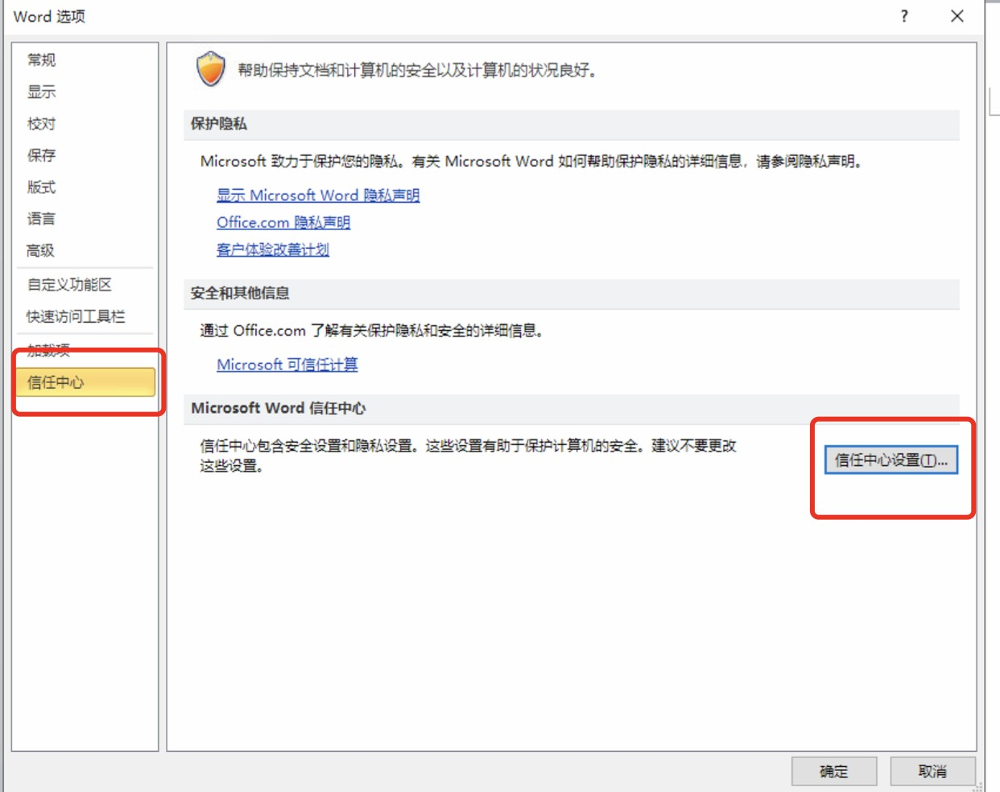
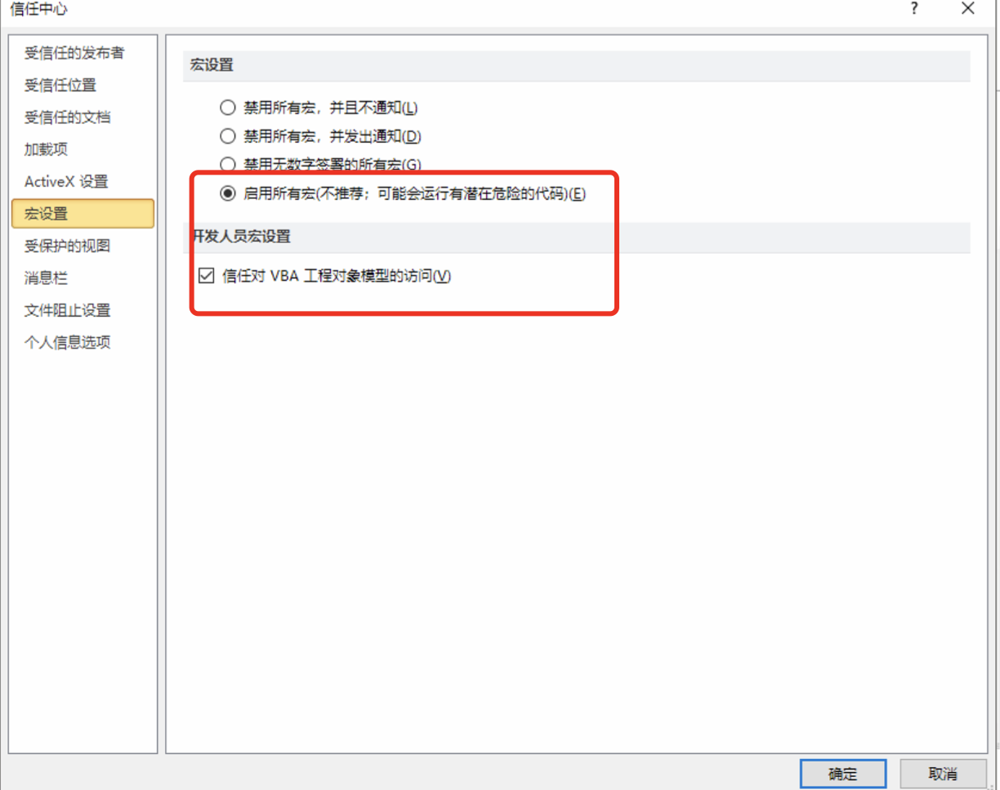

# 第1节：编辑证书环境问题 

本地office注意事项：

- 遇到编辑证书或核验、签发证书时pageoffice卡顿影响使用的情况请考虑升级本地office软件
- 证书分为封皮、附页，根据检测类型任意组合然后编辑证书
- 北京实验室：统一使用wps
- 京外实验室：统一使用office
- 如出现调用宏失败或创建临时文件temp 失败请按照下面的设置对本机office进行设置
- 
- 

环境要求：

1. 操作系统推荐：Win7、Win8.1、Win10 等非Home版的Windows系统；

2. 操作系统必须有D盘。

3. Office推荐：Office 2010及以上版本（非Home版、非Student版）；，如果电脑上有多个office软件请先卸载之后在安装。

​      4. 京外实验室如果不是xp系统，推荐使用最新版谷歌浏览器，如果是xp系统通过计量系统帮助中心下载适应xp系统的谷歌浏览器。

5. 客户端电脑需要安装pageoffice插件。